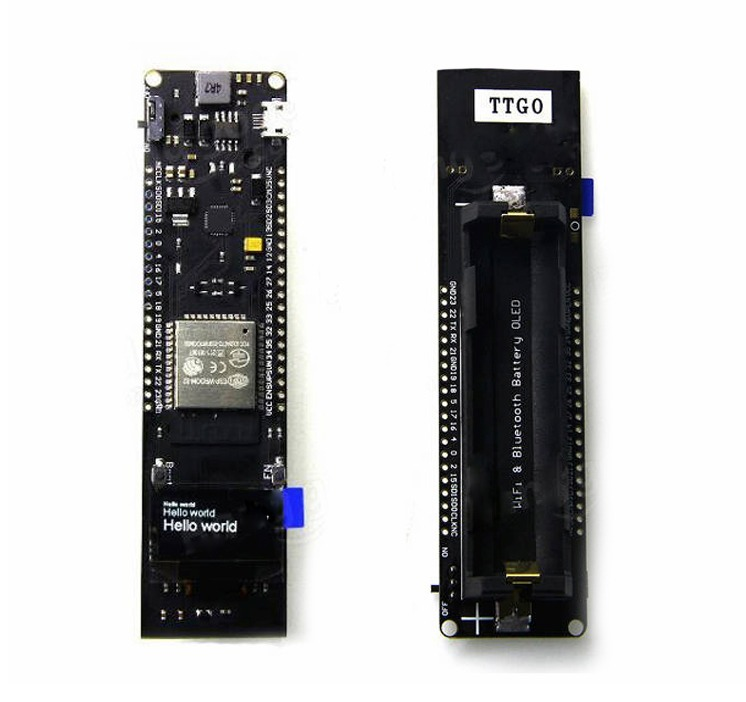
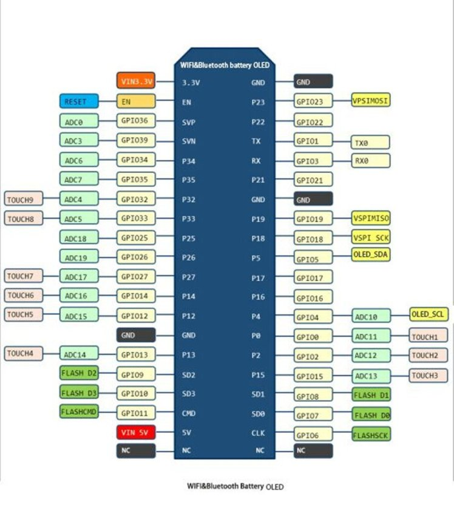

# esphome_musicanalyser
Project for creating a sound analyser to control lights in home assistant

Playground for

## TTGO WiFi & Bluetooth Battery ESP32 0.96 inch OLED development tool  
## and a mic

#### TTGO Features:

* 18650 charging system integrated.  
* Indicate LED inside (Green means full & Red means charging)  
* Charging and working could be at the same time.  
* 1 Switch could control the power  
* 1 extra LED could be programmed(Connected with GPIO16[D0])  
* 0.5A charging current   
* 1A output   
* Over charge protection   
* Over discharge protection   
* Full ESP32 pins break out 

#### Connecting TTGO ESP32 and MIC:

TTGO | MIC
------------ | -------------
VCC | VVC
GND | GND
36 | out

#### Install and build:

* Copy the content of the esphome dir in your esphome folder
* Go to the device in your esphome webpage and install